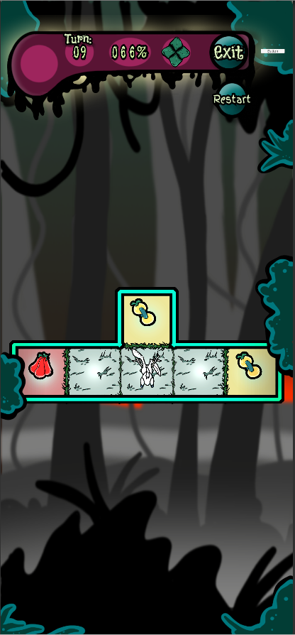
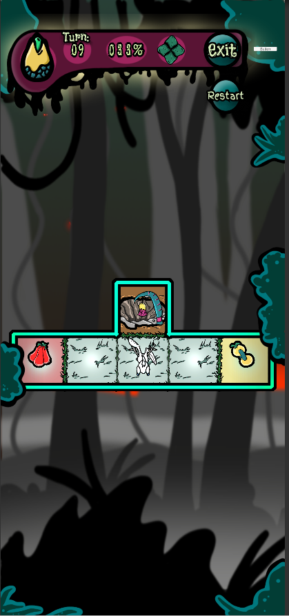

# Harvest or Die LLM Puzzle Agent

An LLM Agent that plays **Harvest or Die**, a turn-based grid puzzle game I built in Unity.

In the game you play as the bunny and your goal is to make all fruit the same color. To do that, you harvest a fruit which gives you a colored seed. 
 

The point of this project is not only to get a language model to play the game, but the measurement apparatus around it. There is a validated simulator, a reproducible eval harness, deterministic baselines, and controlled ablations to isolate *why* the agent fails.

---

## Headline result

On `level_3` (9-turn limit), 100 episodes per configuration:

| Agent | Win rate | Deaths | Timeouts | Mean turns |
|---|---|---|---|---|
| Random (legal moves only) | 0.01% (1/10,000) | ~100% | <1% | — |
| Greedy (1-step lookahead, exact forward model) | 15.9% [13.6–18.2] | **0%** | 84% | 8.7 |
| LLM, board only | 15.0% [8.0–22.0] | 66% | 19% | 4.6 |
| **LLM + fatal-move annotation** | **31.0% [21.9–40.1]** | **1%** | 68% | 8.5 |

--- 
