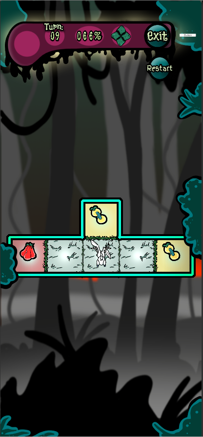
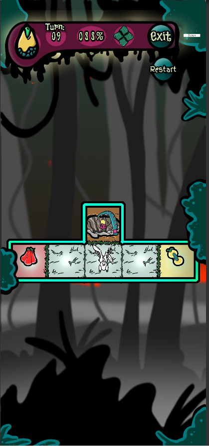

# Harvest or Die LLM Puzzle Agent

An LLM Agent that plays **Harvest or Die**, a turn-based grid puzzle game I built in Unity.

In the game you play as the bunny and your goal is to make all fruit the same color. To do that, you harvest a fruit which gives you a colored seed. 

 

The point of this project is not only to get a language model to play the game, but the measurement apparatus around it. There is a validated simulator, a reproducible eval harness, deterministic baselines, and controlled ablations to isolate *why* the agent fails.

Four different methodologies are compared here.

Random: The bunny makes random legal moves

Greedy: The agent simulates every legal move one step ahead, discards any that would kill it, and picks whichever leaves the board closest to a win by the solver's distance estimate.

LLM, Board Only: The model sees just the rendered board and status text, so it must work out for itself whether a move is lethal.

LLM + fatal-move annotation: The same prompt plus an explicit list of which legal moves would kill it this turn, computed by the simulator and handed over rather than inferred

---

## Headline result

### Level 3 — all agents, 250 episodes each

| Agent | Win rate | Death | Timeout | Mean turns |
|---|---|---|---|---|
| Random (legal moves only) | 0.0% [0.0–0.0] | 100.0% | 0.0% | 2.2 |
| Greedy (1-step lookahead, exact forward model) | 18.4% [13.6–23.2] | 0.0% | 81.6% | 8.6 |
| LLM, board only | 20.4% [15.4–25.4] | 60.8% | 18.8% | 5.1 |
| **LLM + fatal-move annotation** | **34.0% [28.1–39.9]** | **0.8%** | 65.2% | 8.4 |

95% CIs, normal approximation. `level_3` has a 9-turn limit and no predators, so cornering is 0% throughout.

Without being given an explicit list of deadly moves the LLM agent statistically ties with the greedy agent (20.4% vs 18.4%). This is because the LLM dies 61% of the time while the greedy agent runs out of turns. This confirmed not only be the number of deaths and timeout but the average number of turns the greedy agent takes versus the LLM. 

When the LLM is given an explicit list of deadly moves then the LLM beats Greedy. It win's 34% of the time and only times out 64% of the time. 

### Level 14 — the hard level, 28-turn limit with predators

| Agent | n | Win | Death | Cornered | Timeout | Mean turns |
|---|---|---|---|---|---|---|
| Random (legal moves only) | 1000 | 0.0% | 99.4% | 0.6% | 0.0% | 2.9 |
| Greedy (1-step lookahead) | 1000 | 0.0% | **0.0%** | **56.5%** [53.4–59.6] | 43.5% | 17.7 |
| LLM, board only | 30 | 0.0% | 96.7% | 3.3% | 0.0% | 11.7 |
| **LLM + fatal annotation** | 40 | **7.5%** [0.0–15.7] | 10.0% | **32.5%** [18.0–47.0] | 50.0% | 22.3 |

LLM rows pooled across runs; n is small because each episode is up to 28 sequential API calls.

Level 14 introduces enemeys slimes so 'Cornered' was included as a final state for an agent. This occurs when the agent is cornered by enemy slimes and there is no where safe for it to go/.

Here only the LLM agent with the explicit list of deadly moves wins at all. The LLM agent without the explicit list of dead moves survives longer than the greedy agent with an average turn count of 22.3 compared to 17.7
--- 